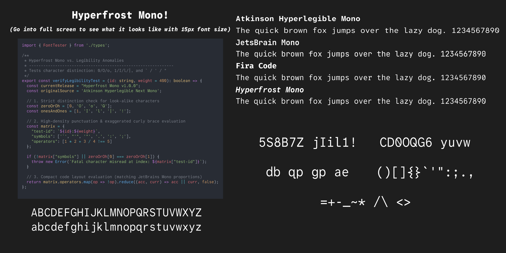

# Hyperfrost Mono

It is a fork of the Atkinson Hyperlegible Mono font family that I have thoroughly modified which also includes **several crucial adjustments**, so that it suits me personally and coding overall, and I wanted to share it with y'all!

You can move down to see all the **modifications** or [jump to the Modifications Section](#modifications)

**Hyperfrost Mono** is a customized, high-density variant of the Atkinson Hyperlegible Mono font family, tailored specifically for developers who prefer compact coding fonts of those such as JetBrains Mono while preserving the readability of Atkinson Hyperlegible Mono.

## Preview


## Modifications
- **Increased Code Density:** Squashed character width to fit more code horizontally on screen to match the proportions of JetBrains Mono, Fira Code and most of other coding fonts.
- **Centered and Enlarged Asterisk (`*`):** Adjusted the vertical alignment of the asterisk down to the middle and increased the size.
- **Distinctive Curly Braces (`{}`):** Changed to more exaggerated, elegant curly braces for better distinction against square brackets (`[]`) and parentheses (`()`)
- **Embolden Punctuations:** Thickened `"`, `'`, ```, `.`, `:`, and `;` for better visibility.
- **Larger Characters:** All characters are enlarged for easier readability and legibility when using smaller font sizes.
- **Cleaned Metadata:** Renamed all internal font tables to comply with the SIL Open Font License (OFL) naming restrictions.

## Disclaimer & Credits
This project is a modified fork of [Atkinson Hyperlegible Next Mono](https://github.com/googlefonts/atkinson-hyperlegible-next-mono) created by the Braille Institute.

Hyperfrost Mono is an independent project. It is not affiliated with, sponsored by, or endorsed by the Braille Institute of America.

## License
This font is licensed under the **SIL Open Font License v1.1**. See the `OFL.txt` file for the full text.
